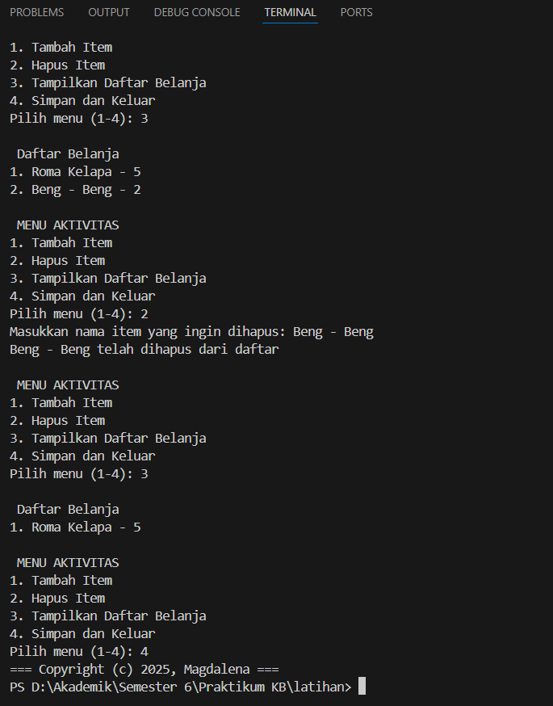

## PENJELASAN
1. Struktur Kontrol
Perulangan (while True) untuk menu interaktif.
Percabangan (if-elif-else) untuk menangani pilihan menu.
2. Struktur Data
Menggunakan list untuk menyimpan daftar belanja dalam bentuk dictionary.
3. Library yang digunakan
json untuk menyimpan daftar belanja ke dalam file JSON.

